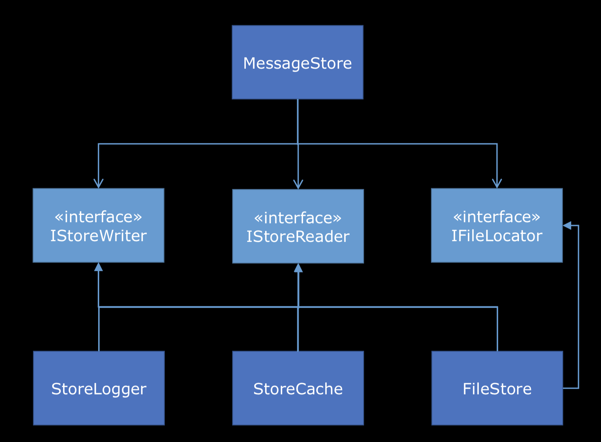

# Depenency Inverion Principle DIP

Describe relationship between abstract and concrete types

SRP (a lot small classes) ISP (a lot small interfaces)
Fine-grained classes with a single mwthod.

Objects are date with behavior.

```
public class FileStore : IMessageQuery
{
    private readonly DirectoryInfo workingDirectory;
    public FileStore(DirectoryInfo workingDirectory)
    {
        this.workingDirectory = workingDirectory;
    }
    public string Read(int id)
    {
        var path = Path.Combine(
            this.workingDirectory.FullName,
            id + ".txt");
        return File.ReadAllText(path);
    }
}
```

Functions are pure behavior

```
Func<DirectoryInfo, int, string> read = (workingDirectory, id) =>
    {
        var path = Path.Combine(
            workingDirectory.FullName,
            id + ".txt");
        return File.ReadAllText(path);
};
```

Closures - behaviour with data

```
var workingDirectory = new DirectoryInfo(Environment.CurrentDirectory);

Func<int, string> read = id =>
    {
        var path = Path.Combine(
            workingDirectory.FullName,
            id + ".txt");
        return File.ReadAllText(path);
};
```

What does that compile to?

```
[CompilerGenerated]
private sealed class <>c__DisplayClass3
{
    public DirectoryInfo workingDirectory;

    public string <UseClosure>b__2(int id)
    {
        return File.ReadAllText(
    }
}
```

What’s more lightweight? - Closures

## Depenency Inverion Principle

High-level modules should not depend on low-level modules. Both should depend on abstractions.

Abstractions should not depend upon details. Details should depend upon abstractions.

Favour Composition over inheritance. (Use interface and composition)

### Composite (design pattern)

```
public void Save(int id, string message)
{
new LogSavingStoreWriter().Save(id, message);
this.Store.Save(id, message);
this.Cache.Save(id, message);
new LogSavedStoreWriter().Save(id, message);
}
```

IStoreWriter

```
public interface IStoreWriter
{
    void Save(int id, string message);
}
```

CompositeStoreWriter

```
public class CompositeStoreWriter : IStoreWriter
{
    private readonly IStoreWriter[] writers;

    public CompositeStoreWriter(params IStoreWriter[] writers)
    {
        this.writers = writers;
    }

    public void Save(int id, string message)
    {
        foreach (var w in this.writers)
          w.Save(id, message);
    }
}
```

Than

```
public void Save(int id, string message)
{
    this.Writer.Save(id, message);
}
```

in MessageStore constructor

```
public MessageStore(DirectoryInfo workingDirectory)
{
  this.WorkingDirectory = workingDirectory;
  var c = new StorageCache();
  this.cache = c;
  this.log = new StoreLogger();
  var fileStore = new FileStore(workingDirectory);
  this.store = fileStore;
  this.fileLocator = fileStore;
  this.writer = new CompositeStoreWriter(
    new LogSavingStoreWriter,
    fileStore,
    c,
    new LogSavedStoreWriter()
  );
}
```

### Decorator (design pattern)

can be used both for commands and for queries.
So a Decorator is almost like a composite in the sense that it's a class that implements an interface.

```
public class StoreCache : IStoreCache, IStoreWriter
{
    private readonly ConcurrentDictionary<int, Maybe<string>> cache;
    private readonly IStoreWriter writer; //add

    public StoreCache(IStoreWriter writer) //add args
    {
        this.cache = new ConcurrentDictionary<int, Maybe<string>>();
        this.writer = writer;
    }

    public virtual void Save(int id, string message)  //Add save method
    {
        this.writer.Save(id, message); //add
        var m = new Maybe<string>(message);
        this.cache.AddOrUpdate(id, m, (i, s) => m);
    }

    public virtual Maybe<string> GetOrAdd(int id, Func<int, Maybe<string>> messageFactory)
    {
        return this.cache.GetOrAdd(id, messageFactory);
    }
}
```

in MessageStore constructor

```
public MessageStore(DirectoryInfo workingDirectory)
{
  this.WorkingDirectory = workingDirectory;
  var fileStore = new FileStore(workingDirectory); //add
  var c = new StorageCache(fileStore); //send fileStore
  this.cache = c;
  this.log = new StoreLogger();
  this.store = fileStore;
  this.fileLocator = fileStore;
  this.writer = new CompositeStoreWriter(
    new LogSavingStoreWriter,
    //fileStore,
    c,
    new LogSavedStoreWriter()
  );
}
```

StoreLogger

```
public class StoreLogger : IStoreLogger, IStoreWriter //IStoreWriter add
{
    //Add
    private readonly IStoreWriter writer;

    public StoreLogger(IStoreWriter writer)
    {
       this.writer = writer;
    }

    public void Save(int id, string message)
    {
      Log.Information("Saving message {id}.", id);
      this.writer.Save(id, message);
      Log.Information("Saved message {id}.", id);
    }
    //Add

    public virtual void Saving(int id, string message)
    {
      Log.Information("Saving message {id}.", id);
    }

    //...
}
```

in MessageStore constructor

```
public MessageStore(DirectoryInfo workingDirectory)
{
    this.WorkingDirectory = workingDirectory;
    var fileStore = new FileStore(workingDirectory);
    var c = new StoreCache(fileStore);
    this.cache = c;
    var l = new StoreLogger(c);
    this.log = l;
    this.store = fileStore;
    this.fileLocator = fileStore;
    this.writer = l; //= new CompositeStoreWriter(l);
}
```

Read all method inside take id like arg

```
public interface IStoreCache
{
    void Save(int id, string message);
    Maybe<string> GetOrAdd(int id); //delete Func<int, Maybe<string>> messageFactory (add to the cache if member not on cache)
}
```

Before

```
  public Maybe<string> Read(int id)
  {
    this.Log.Reading(id);
    var message = this.Cache.GetOrAdd(
      id, _=> this.Store.ReadAllText(id));
    if (message.Any())
      this.Log.Returning(id);
    else
      this.Log.DidNotFind(id);
    return message;
  }
```

After

```
public Maybe<string> Read(int id)
{
    this.Log.Reading(id);
    var message = this.Cache.GetOrAdd(id); // only id
    if (!message.Any())
    {
        message = this.Store.ReadAllText(id);
        if (message.Any())
          this.Cache.Save(id, message.Single());
        if (message.Any())
          this.Log.Returning(id);
        else
           this.Log.DidNotFind(id);
    return message;
}
```

IStoreCache

```
public interface IStoreCache
{
    void Save(int id, string message);
    Maybe<string> Read(int id); //GetOrAdd -> Read
}
```

IStore

```
public interface IStore
{
    void Save(int id, string message);
    Maybe<string> Read(int id); //ReadAllText -> Read
}
```

Than (Read)

```
public Maybe<string> Read(int id)
{
    this.Log.Reading(id);
    var message = this.Cache.Read(id); // only id
    if (!message.Any())
    {
        message = this.Store.Read(id);
        if (message.Any())
          this.Cache.Save(id, message.Single());
        if (message.Any())
          this.Log.Returning(id);
        else
           this.Log.DidNotFind(id);
    return message;
}
```

Create IStoreReader

```
public interface IStoreReader
{
    Maybe<string> Read(int id);
}
```

Than (apply decorator)

```
public class StoreCache : IStoreCache, IStoreWriter, IStoreReader     //Add IStoreReader (add rear)
{
    private readonly ConcurrentDictionary<int, Maybe<string>> cache;
    private readonly IStoreWriter writer; //add
    private readonly IStoreReader reader; //add

    public StoreCache(IStoreWriter writer, IStoreReader reader) //add IStoreReader
    {
        this.cache = new ConcurrentDictionary<int, Maybe<string>>();
        this.writer = writer;
        this.reader = reader; // add
    }

    public virtual void Save(int id, string message)  //Add save method
    {
        this.writer.Save(id, message); //add
        var m = new Maybe<string>(message);
        this.cache.AddOrUpdate(id, m, (i, s) => m);
    }

    public virtual Maybe<string> Read(int id)
    {
        Maybe<string> retVal;
        if (this.cache.TryGetValue(id, out retVal))
            return retVal;
        //return new Maybe<string>();
        //Add (remove from )
        retVal = this.reader.Read(id);
        if (retVal.Any())
          this.cache.AddOrUpdate(id, retVal, (i, s) => retVal);

        return retVal;
        //Add
    }
}
```

in Read

```
public Maybe<string> Read(int id)
{
    this.Log.Reading(id);
    var message = this.Cache.Read(id);
    if (message.Any())
        this.Log.Returning(id);
    else
        this.Log.DidNotFind(id);
    return message;
}
```

StoreLogger

```
public class StoreLogger : IStoreLogger, IStoreWriter, IStoreReader //add IStoreReader
{
    private readonly IStoreWriter writer;
    private readonly IStoreReader reader; //add

    public StoreLogger(IStoreWriter writer, IStoreReader reader)
    {
        this.writer = writer;
        this.reader = reader; //add
    }

    public void Save(int id, string message);

    public Maybe<string> Read(int id)   //add
    {
        Log.Debug("Reading message {id}.", id);
        var retVal = this.reader.Read(id);
        if (retVal.Any())
          Log.Debug("Returning message {id}.", id);
        else
          Log.Debug("No message {id} found.", id);
        return retVal;
    }

    public virtual void Saving(int id, string message)
    public virtual void Saved(int id, string message)
    public virtual void Reading(int id)
    public virtual void DidNotFind(int id)
    public virtual void Returning(int id)
}
```

Than

```
public MessageStore(DirectoryInfo workingDirectory)
{
    this.WorkingDirectory = workingDirectory;
    var fileStore = new FileStore(workingDirectory);
    var c = new StoreCache(fileStore, fileStore);
    this.cache = c;
    var l = new StoreLogger(c, c); //add
    this.log = l;
    this.store = fileStore;
    this.fileLocator = fileStore;
    this.writer = l;
    this.reader = l;
}
```

## Final clean-up

MessagaStore

```
public class MessageStore
{
    private readonly IStoreCache cache;
    private readonly IStoreLogger log;
    private readonly IStore store;
    private readonly IFileLocator fileLocator;
    private readonly IStoreWriter writer;
    private readonly IStoreReader reader;

    public MessageStore(DirectoryInfo workingDirectory)
    {
        this.WorkingDirectory = workingDirectory;
        var fileStore = new FileStore(workingDirectory);
        var c = new StoreCache(fileStore, fileStore);
        this.cache = c;
        var l = new StoreLogger(c, c);
        this.log = l;
        this.store = fileStore;
        this.fileLocator = fileStore;
        this.writer = l;
        this.reader = l;
    }

  public DirectoryInfo WorkingDirectory { get; private set; }
```

To

```
public class MessageStore
{
    private readonly IFileLocator fileLocator;
    private readonly IStoreWriter writer;
    private readonly IStoreReader reader;

    public MessageStore(
        IStoreWriter writer,
        IStoreReader reader,
        IFileLocator fileLocator)
    {
        if (writer == null)
            throw new ArgumentNullException("writer");
        if (reader == null)
            throw new ArgumentNullException("reader");
        if (fileLocator == null)
            throw new ArgumentNullException("fileLocator");
        this.fileLocator = fileLocator;
        this.writer = writer;
        this.reader = reader;
    }

  public void Save (int id, string message)
  {
    this.writer.Save(id, message);
  }

  public Maybe<string> Read(ind id)
  {
    return this.reader.Read(id);
  }

  public FileInfo GetFileInfo(ind id)
  {
    return this.fileLocator.GetFileInfo(id);
  }
}
```

StoreCache

```
public class StoreCache : IStoreWriter, IStoreReader
{
    public StoreCache(IStoreWriter writer, IStoreReader reader)
    public void Save(int id, string message) //delete virtual (we not relie on inheritance)
    public Maybe<string> Read(int id)
}
```

FileStore

```
public class FileStore : IFileLocator, IStoreWriter, IStoreReader
{
    public FileStore(DirectoryInfo workingDirectory)
    public void Save(int id, string message) //delete virtual
    public Maybe<string> Read(int id)
    public FileInfo GetFileInfo(int id)
}
```

```
public class StoreLogger : IStoreWriter, IStoreReader
{
    private readonly ILogger log; //add
    private readonly IStoreWriter writer;
    private readonly IStoreReader reader;

    public StoreLogger(ILogg er log, IStoreWriter writer, IStoreReader reader)
    {
        this.log = log;
        this.writer = writer;
        this.reader = reader;
    }

    public void Save(int id, string message)
    {
        this.log.Information("Saving message {id}.", id);
        this.writer.Save(id, message);
        this.log.Information("Saved message {id}.", id);
    }

    public Maybe<string> Read(int id)
    {
        this.log.Debug("Reading message {id}.", id);
        var retVal = this.reader.Read(id);
```

```
var logger = new LoggerConfiguration().CreateLogger(); var fileStore =
    new FileStore(
        new DirectoryInfo(
            Environment.CurrentDirectory));
var cache = new StoreCache(fileStore, fileStore);
var log = new StoreLogger(logger, cache, cache);
var msgStore = new MessageStore(
    log,
    log,
    fileStore);
```


