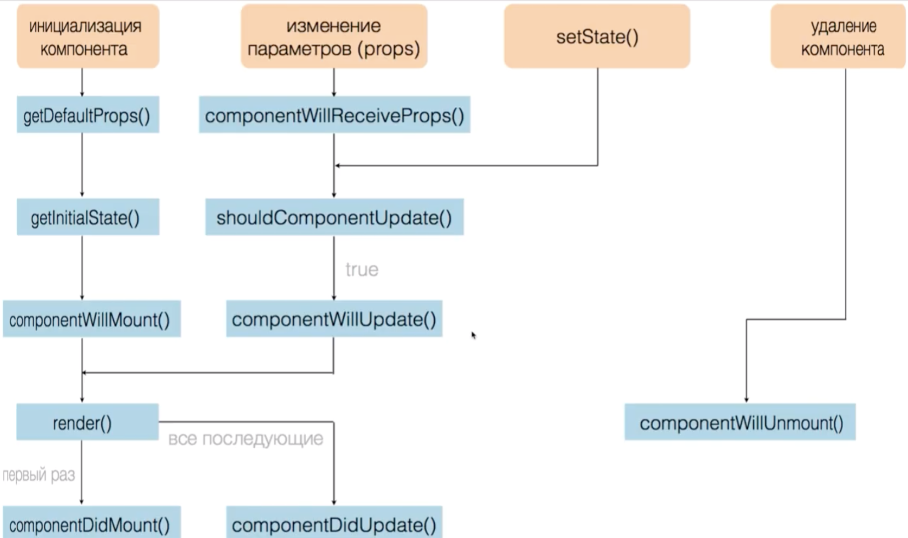

# Life Cycle 



## Component Initialization

componentWillMount()
It is usually used to obtain the necessary data (from the server)

componentDidMount()
It is usually used to respond to data occurrences or hang liceners.

## Change settings (props)

componentWillReceiveProps(nextProps)
It is usually used:
- when we tied state with props
- article arrived and you need to download data from the server

```
//Article class start
constructor(props) {
    super(props)

    this.state = {
        isOpen: props.defaultOpen //props to state
    }
}
componentWillReceiveProps(nextProps) {
    if (nextProps.defaultOpen !== this.props.defaultOpen) this.setState({
        isOpen: nextProps.defautOpen
    })
}
//Article class end

import React from 'react';
import Article from '../Article';

export default function ArticleList({ articles }) {
    const articleElements = articles.map([article, index] => 
        <li key={article.id} className="arrticle-list_li">
            <Article article = {article} defaulOpen = {index === 0}/> //true only when index equal zero
        </li>
    )
    return (
        <ul>
            {articleElements}
        </ul>
    )
}
```

shouldComponentUpdate(nextProps, nextState)
Do we need to rebuild a virtual DOM for this component or not.
Allows you to optimize components

```
// add in Article 
shouldComponentUpdate(nextProps, nextState) {
    return this.state.isOpen !== nextState.isOpen //willUpdate we call only when it is necessary
}
```
But there can be a conflict (we must track all changes props and state). Can be used PureComponent (class Article extends PureComponents). 
He implements a method shouldComponentUpdate.

componentWillUpdate(nextProps, nextState)
Now we will rebuild, we have ready props and state

componentDidUpdate(prevProps, prevState)

## Deleting a component

componentWillUnmount()
Сlear subscriptions
